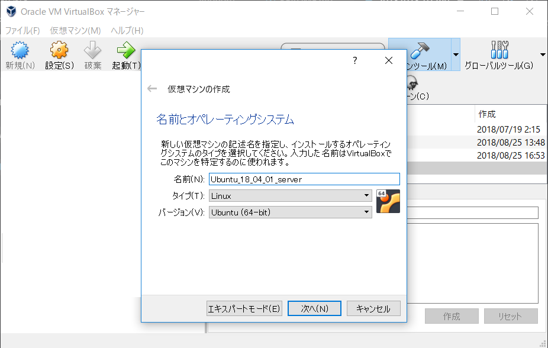
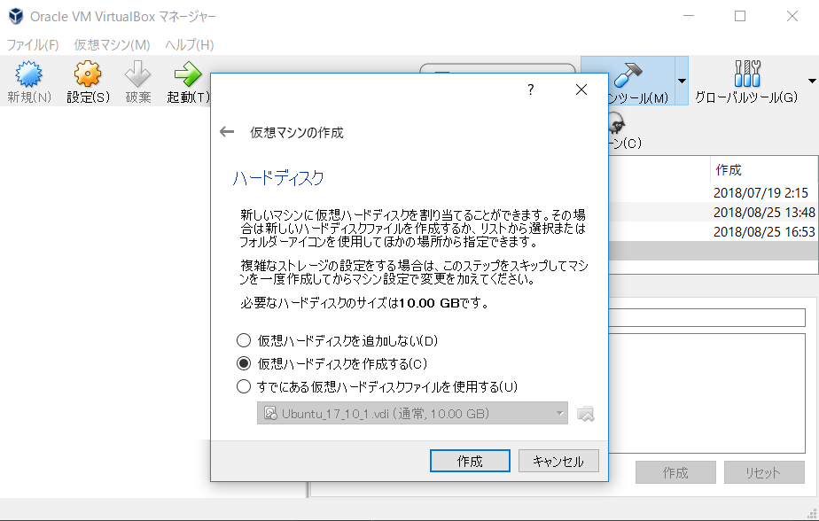
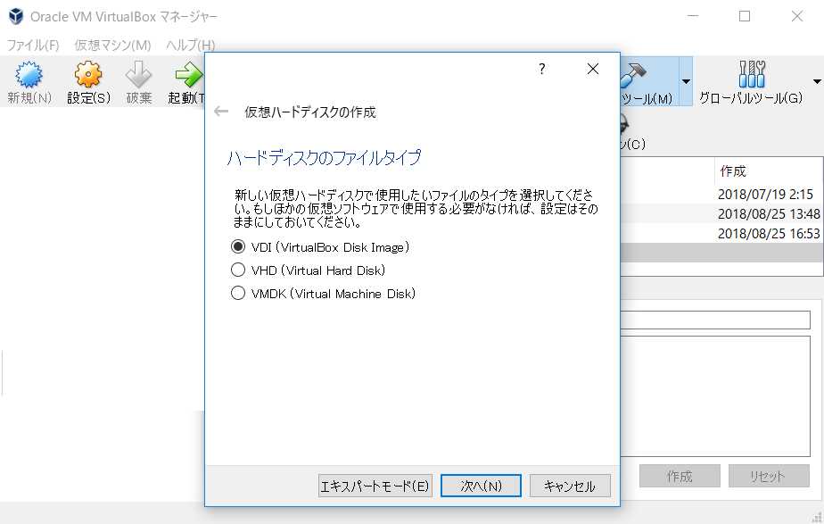
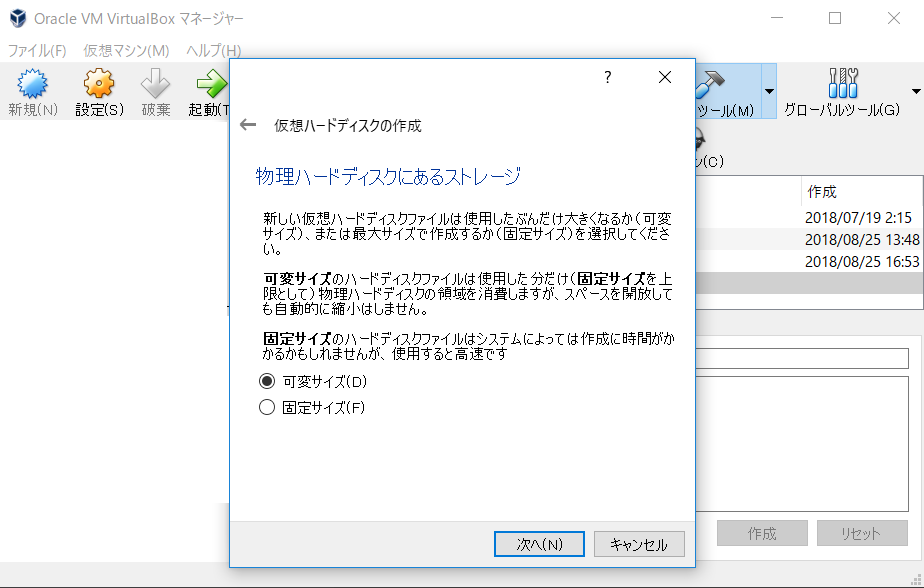
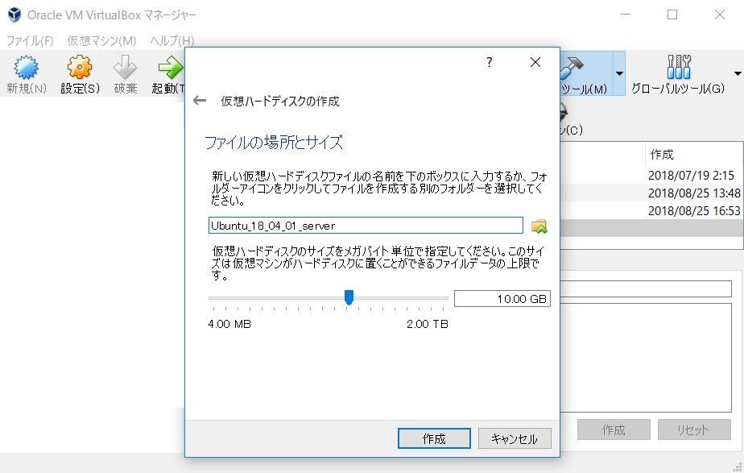

# own_tech_blog

このブログは自分で開発環境構築～Webアプリケーション開発を行う記録と
再度同じ手順をなぞるための備忘録を目的としています。

python3 + Django についての質問はさっと思い浮かぶものだけ答えられるかもしれません。
ブラウザや特定のヘッダを要するなど、環境に依存する動作については恐らく答えられないのでご注意下さい。

---

## 開発環境構築その

### １．仮想マシン作成(VirtualBox)

1. 準備
   1. VirtualBox(5.2.20)インストール
   1. Ubuntuイメージ(18.04.01)ダウンロード

1. 仮想マシン作成
   1. 名前入力、タイプ、バージョン決定
      - 名前:任意、タイプ:Linux、バージョン: Ubuntu (64-bit)
     

   1. メモリサイズ
      - デフォルト(1024MB)

   1. ハードディスク
      - "仮想ハードディスクを作成する" を選択
     
    
   1. ハードディスクのファイルタイプ
      - "VDI" を選択
     

   1. 物理ハードディスクにあるストレージ
      - "可変" を選択
     

   1. ファイルの場所とサイズ
      - 特に変更なし、"作成" ボタンを選択して完了
     

### 2. 仮想マシンへUbuntu18.04.01インストール

... now constructing ...

