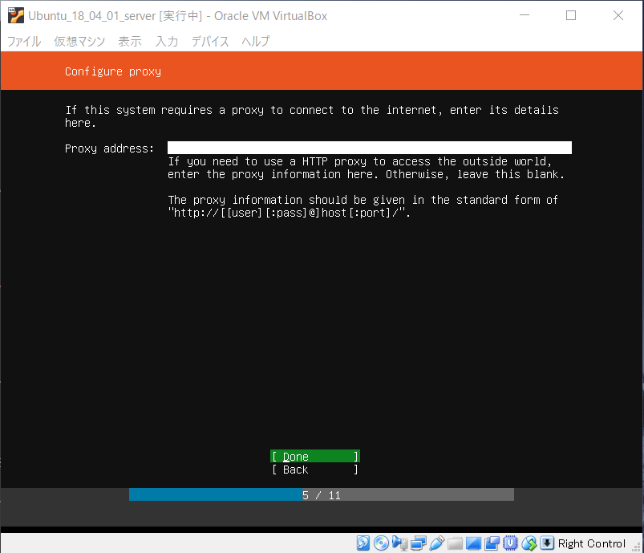
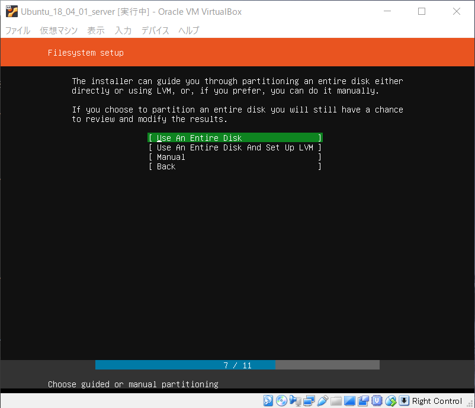
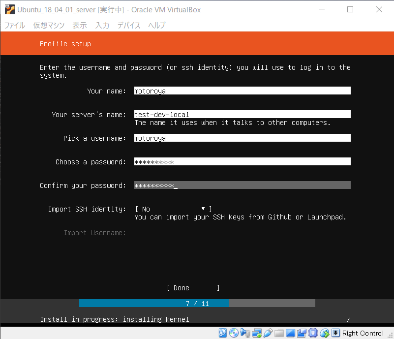

# own_tech_blog

このブログは自分で開発環境構築～Webアプリケーション開発を行う記録と
再度同じ手順をなぞるための備忘録を目的としています。

python3 + Django についての質問はさっと思い浮かぶものだけ答えられるかもしれません。
ブラウザや特定のヘッダを要するなど、環境に依存する動作については恐らく答えられないのでご注意下さい。

---

## 開発環境構築その

### １．仮想マシン作成(VirtualBox)

1. 準備
   1. VirtualBox(5.2.20)インストール
   1. Ubuntuイメージ(server 18.04.01)ダウンロード

1. 仮想マシン作成
   1. 名前入力、タイプ、バージョン決定
      - 名前:任意、タイプ:Linux、バージョン: Ubuntu (64-bit)
     

   1. メモリサイズ
      - デフォルト(1024MB)

   1. ハードディスク
      - "仮想ハードディスクを作成する" を選択
     
    
   1. ハードディスクのファイルタイプ
      - "VDI" を選択
     

   1. 物理ハードディスクにあるストレージ
      - "可変" を選択
     

   1. ファイルの場所とサイズ
      - 特に変更なし、"作成" ボタンを選択して完了
     

### 2. 仮想マシンへUbuntu18.04.01インストール

1. イメージを仮想マシンにセット
   1. ダウンロードしておいた  'ubuntu-18.04.1-live-server-amd64.iso' を選択
   
   

1. 仮想マシン起動、インストール開始

   1. 言語選択
      - English を選択
   

   1. キーボードレイアウト
      - Japanese を選択
   

   1. インストーラ操作選択
      - 'Install Ubuntu' を選択
   

   1. IP設定
      - 一旦DHCPに任せる(Doneを選択)。ホストOSからのSSH用IP設定はあとで行う
   

   1. Proxy設定
      - 特に使用しない。Doneを選択
   

   1. パッケージのミラーサーバ
      - 今回は変更しない。必要があれば "https://www.ubuntulinux.jp/ubuntu/mirrors" を参照し入力
   

   1. ファイルシステム設定１
      - 仮想マシンのHDD(作りたてなので空)にインストール、LVMは設定しない(Use An Entire Disk を選択)
   

   1. ファイルシステム設定２
      - インストール先ディスク確認(Done を選択)
   

   1. ファイルシステム設定３
      - 設定内容確認(Done を選択)
   

   1. ファイルシステム設定４
      - 最終確認確認(「ディスク上書き始めるけど本当にこれでよい？」と聞かれている。Continue を選択)
   

   1. プロファイル設定
      - 上から順に任意の値をで入力し Done を選択
         - ユーザ名(アカウントでない)
         - PC名
         - ユーザ名(アカウント)
         - パスワード(アカウント)
         - パスワード確認
         - ssh key を読み込むか(読み込まないのでそのまま)
   

   1. 追加インストールするアプリケーション選択(snap)
      - インストール時、追加でインストールするアプリケーションを選択できる。
      - PostgreSQL が有ったので迷ったがここではインストールしない。 Done を選択
   

   1. インストール完了
      - Reboot Now を選択し再起動する
   
    
   1. ログイン確認
      - 再起動後、"プロファイル設定" で入力したユーザ名、パスワードでログインできることを確認
   
      - ログインできた。
   

以上でインストール完了。ここまででスナップショットを取っておくとその後の環境構築で失敗して使用不能になってもインストール済み状態から再開できる

### 3. Ubuntu インストール後にやること

... Now Constructing ...
